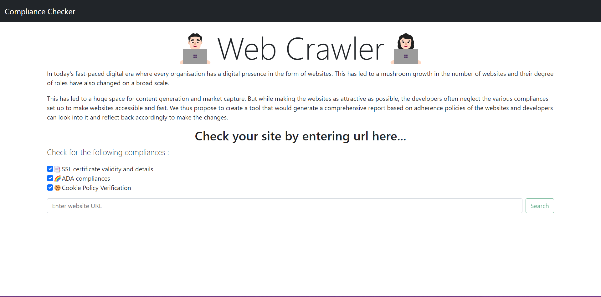
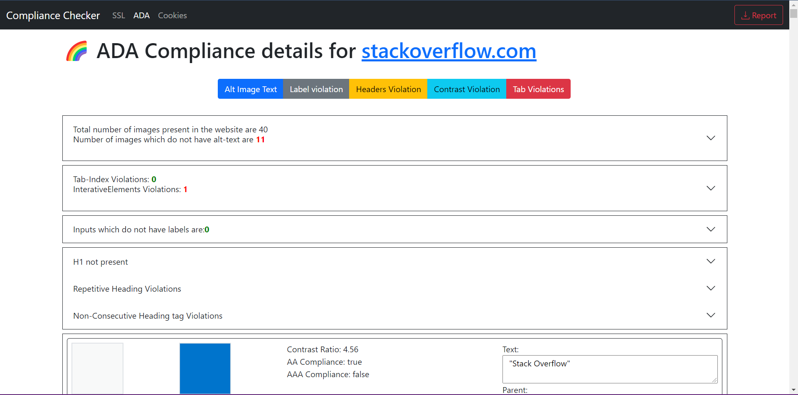
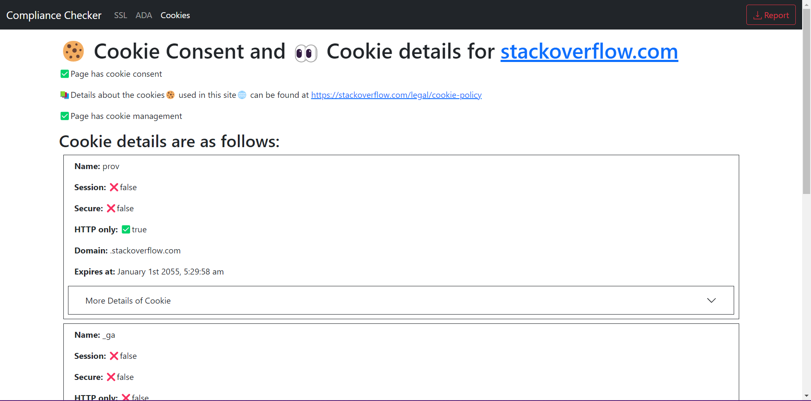

# Web-Crawler

A tool that generates an adherence report of a website based on parameters such as ADA compliance, Cookie Validity and SSL certificates.

We are proposing a tool, which would crawl the web and report the following measures:
- SSL certificate compliance
    - We will be using a library to identify the certificate and its expiry date along.
- Cookie checker
    - We will be running scripts over web drivers to fetch all the cookies and compare them with your database to check their types and mention them in the report. For checking the cookie consent we will be parsing the web pages and looking for specific keywords present in the DOM. 
- ADA compliance
    - We will be selecting a few of the guidelines from the list of ADA compliances set up by W3 consortium based on our prime focus on user accessibility and ease of use. We will then be inspecting the tags of the HTML elements for getting the relevant information. 
 
 Find Website Link Here: [Web-Crawler Link](https://webcrawler-wcc.herokuapp.com/)


## Installation

```bash
git clone https://github.com/darahask/compliance-checker.git
cd compliance-checker
npm install
npm start
```
The server will start running on port `3333` which can be accessed on the browser at `localhost:3333`.

## Tool features
As of now the tool performs the following features:
1. SSL certificate compliance – Checking provided URL for its SSL certificate and providing relevant informations such as:
    - Issued to
    - Issued By
    - Expiry
    - Valid upto
    - and other details of the certificate
2. Cookie checker – Verifying cookies being used by the website, the cookie checker will scan the cookies on the website, and cookie consent verification links. Provides informations such as:
    - Verification
    - Consent
    - Managment
    - Cookie Details for each cookie
3. ADA compliance – Checking websites for:
    - Alternative text of all image tags.
    - Label violation
    - Heading Violation
    - Color contrast for the site as per w3.org guidelines.
    - Accessibility issues to check the site markup for tab index violations
4. Selectivity of which feature to be checked
5. Report is generated and can be downloaded


Screenshots of Web Crawler in action
---------------------------

**Home Page**

</img>

---------------------------
**SSL Information Page**

</img>

---------------------------
**ADA Information Page**

</img>

---------------------------
**Cookie Information Page**

</img>

---------------------------
**Downloadable Report**

</img>


## Tool info
* Release version v2.0.0

## Libraries Used

* [Puppeteer][0] - Headless Chrome over DevTools protocol
* [Express][1] - Rapid development of web based applications
* [CORS][2] - Middleware that can be used to enable CORS with various options.
* [Accessibility Developer Tools][3] - This is a library of accessibility-related testing and utility code.

[0]: https://github.com/puppeteer/puppeteer#readme
[1]: http://expressjs.com/
[2]: https://github.com/expressjs/cors#readme
[3]: https://github.com/GoogleChrome/accessibility-developer-tools


## Future Releases
These features may be part of the next update.
* Display purpose of each cookie

## Maintainers
This project is mantained by:
* [Shubhankar Bhadra](http://github.com/shobhi1310)
* [Darahas Kopparapu](http://github.com/darahask)
* [Shruti Priya](http://github.com/shruti-shrz)
